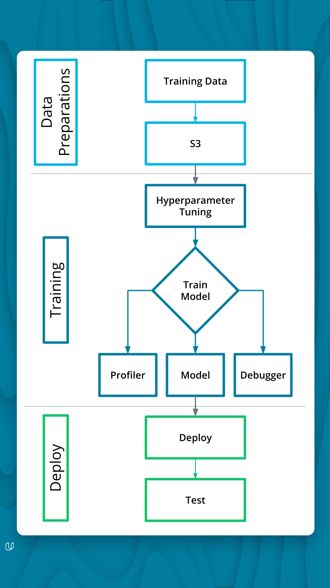
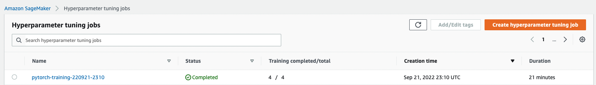
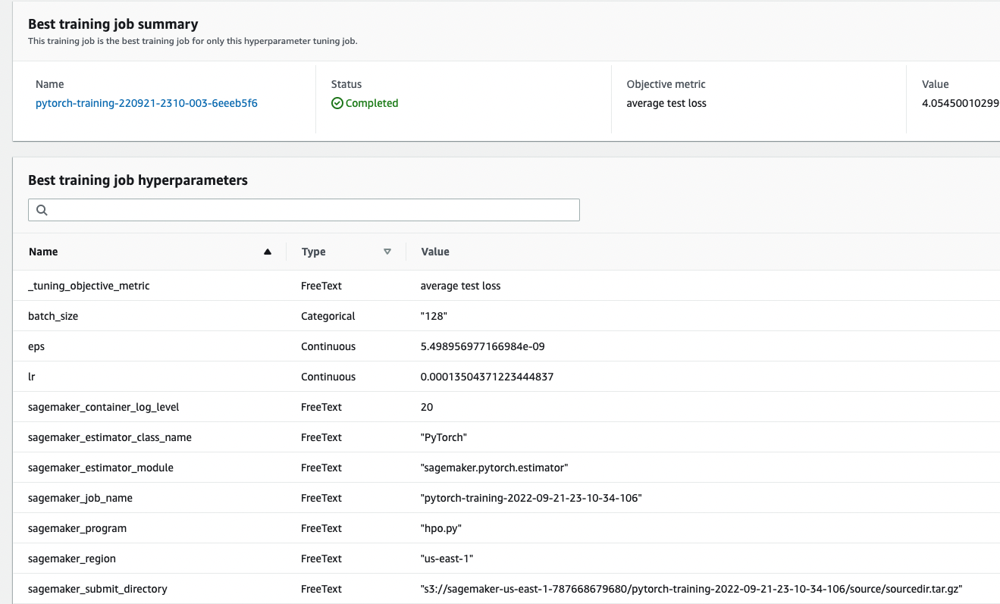
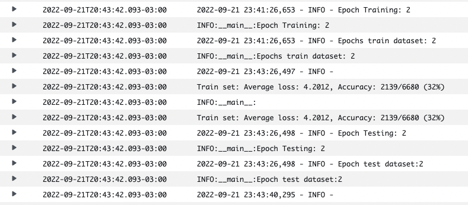
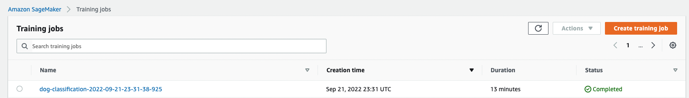
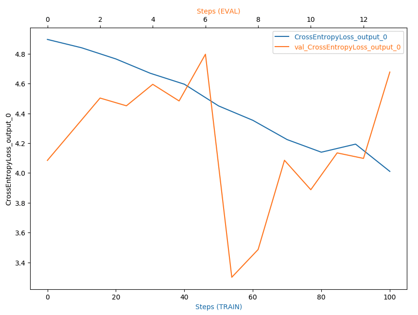
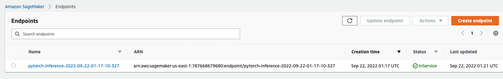

# Dog Breed Classification using AWS SageMaker

Use AWS Sagemaker to train a pretrained model that can perform image classification by using the Sagemaker profiling, debugger, hyperparameter tuning and other good ML engineering practices. This can be done on either the provided dog breed classication data set or one of your choice.

## Overview

This project we will train a model (using ResNet50 and then hyperparameter tuning) and deploy the model to a Sagemaker Endpoint. To test the deployment, we also will query the deployed model with a sample image and get a prediction.

## Project Set Up and Installation
Enter AWS through the gateway in the course and open SageMaker Studio. 
Download the starter files.
Download/Make the dataset available. 

## Dataset
The provided dataset is the dogbreed classification dataset which can be found in the classroom.
The project is designed to be dataset independent so if there is a dataset that is more interesting or relevant to your work, you are welcome to use it to complete the project.

### Access
Upload the data to an S3 bucket through the AWS Gateway so that SageMaker has access to the data. 

## Project Pipeline

## Hyperparameter Tuning
This project we will train a model (using ResNet50 and then hyperparameter tuning). 

Parameters range used for the hyperparameters search:

- learning rate - 0.0001 to 0.1
- eps - 1e-9 to 1e-8
- batch size - 64, 128 and 256

## Hyperparameter tuning jobs

## Best training Hyperparameters

## Best training Hyperparameters

## Best hyperparameters training job logs

## Debugging and Profiling
The Debugging hook track the Cross Entropy Loss from training and validation phases as show below:

Is there some anomalous behaviour in your debugging output? If so, what is the error and how will you fix it?  
If not, suppose there was an error. What would that error look like and how would you have fixed it?

- Seems to have some overfitting. We could try different neural network architecture or use some regularization like dropout.

## Model Deployment
We writed an inference script (endpoint.py) that implements model_fn, predict_fn and input_fn and deployed to a ml.t2.medium instance. (learn more here: https://sagemaker.readthedocs.io/en/stable/frameworks/pytorch/using_pytorch.html#write-an-inference-script) and predicted in a test image.

